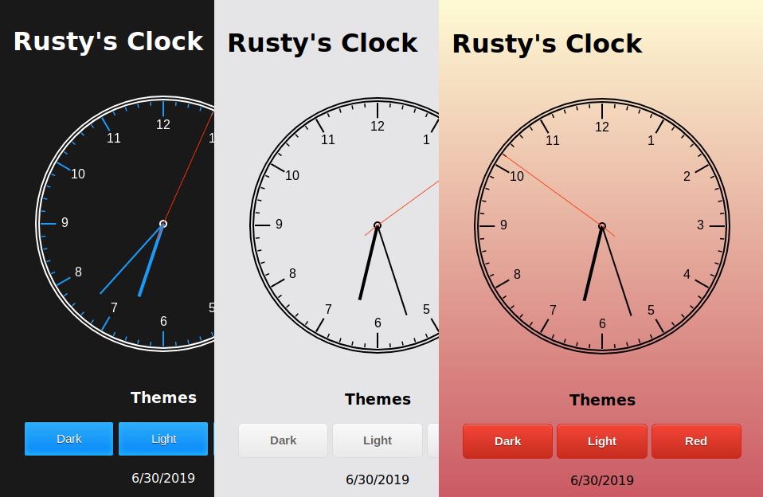

# Analog Clock

This is a simple analog clock made with JavaScript, HTML, and CSS. It utilizes HTML5 Canvas to draw the clock and offers three color theme options: Dark, Light, and Red.

### View Online

* [https://rustyabbott.com/clock](https://rustyabbott.com/clock)

### Note

Formulas within scripts.js use radians, not degrees.

### Screenshot

